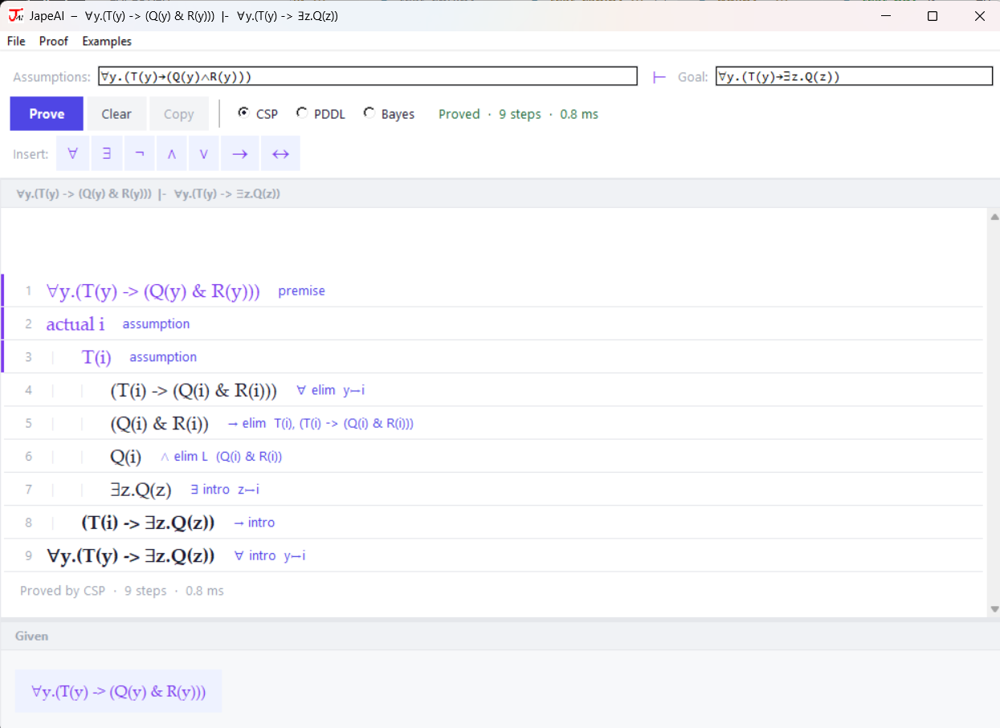
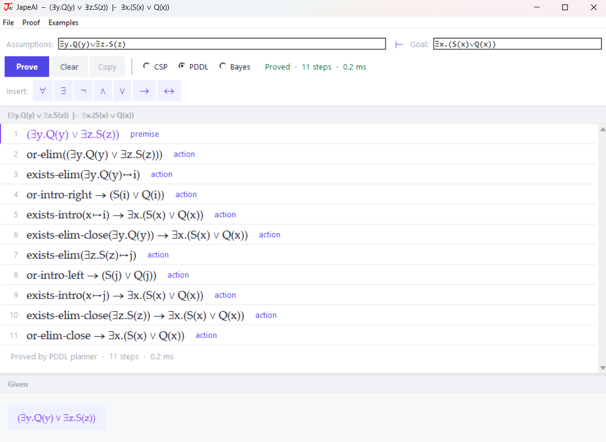
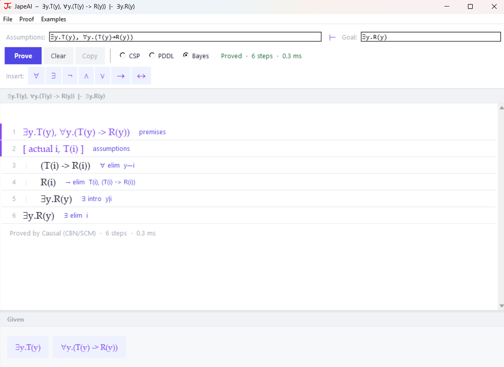
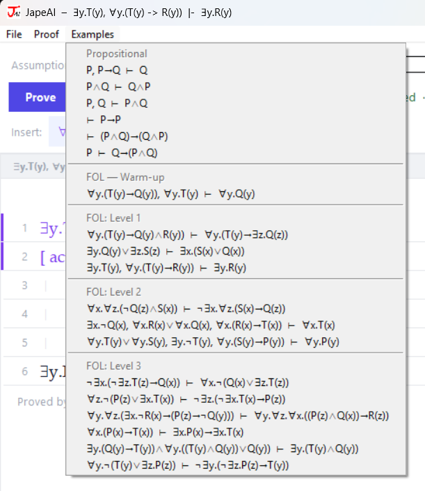
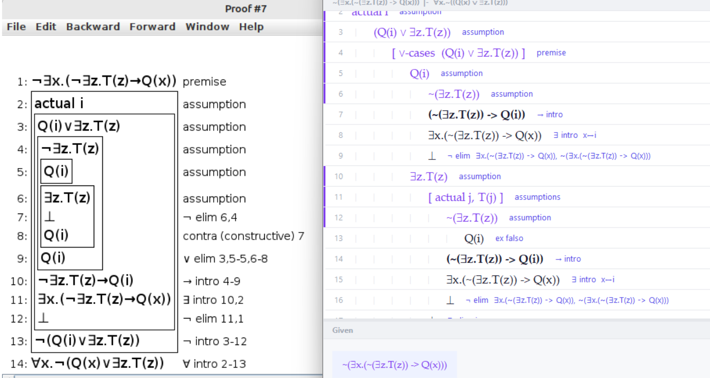
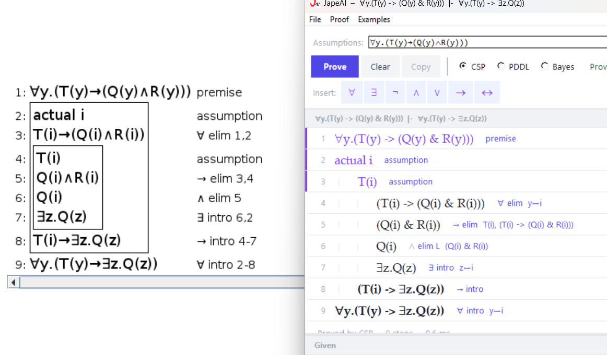
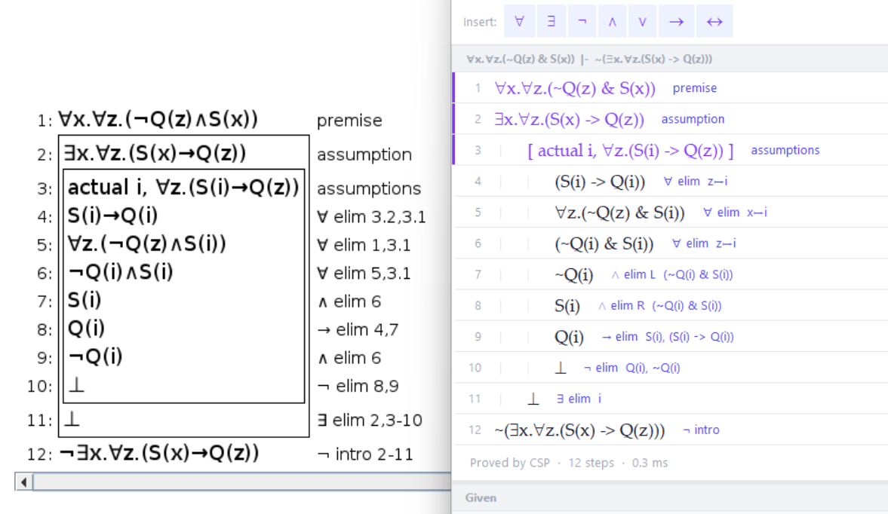

# JapeAI: An Automated Natural Deduction Proof Assistant

## Abstract

JapeAI is a proof assistant that automatically solves propositional and first-order logic (FOL) problems using natural deduction rules. It is built to replicate the output style of Jape, a well-known interactive proof tool developed at Oxford and QMU and a familiar tool for all Computer Science students who have taken CISC 204. Unlike Jape, which requires the user to apply rules manually, JapeAI finds the proof on its own and displays it in a format that closely matches what Jape produces. The system uses three independent solving strategies: a Constraint Satisfaction Problem (CSP) solver that uses iterative-deepening depth-first search, a PDDL-style forward planner that uses breadth-first search, and a Bayesian Network solver that uses best-first probabilistic search guided by a causal graph. All solvers produce human-readable, step-by-step proofs through a tkinter graphical interface or a command-line interface.

---

## 1. Introduction

Natural deduction is a method of formal proof that works the way human reasoning naturally works. Instead of starting from a set of axioms, the user builds proofs by applying small, intuitive rules to formulas. Rules like modus ponens ("if P implies Q, and P is true, then Q is true") are combined step by step until the desired conclusion is reached. Tools like Jape exist to help students work through these problems interactively. The goal of JapeAI is to automate this process entirely. Given a set of assumptions and a goal formula, JapeAI finds a valid proof and presents every step of that proof in a structured, readable format. Three entirely independent solvers run on every problem, each using a different AI strategy, so their outputs can be compared side by side.


---

## 2. Background

### 2.1 Natural Deduction Rules

Natural deduction proofs are built from a fixed set of introduction and elimination rules, one for each logical connective. The most commonly used rules are:

- **And-introduction**: if you can prove A and you can prove B, you can conclude A and B.
- **And-elimination**: if you have A and B, you can extract A alone or B alone.
- **Implication-introduction**: if you assume A and prove B from it, you can conclude that A implies B.
- **Implication-elimination (Modus Ponens)**: if you have A, and you have A implies B, you can conclude B.
- **Negation-introduction**: if assuming A leads to a contradiction, you can conclude not-A.
- **Universal-introduction**: if you prove P(c) for an arbitrary constant c that appears nowhere else, you can conclude "for all x, P(x)".
- **Universal-elimination**: if you have "for all x, P(x)", you can substitute any specific term t to get P(t).
- **Existential-introduction**: if you have P(t) for some term t, you can conclude "there exists x such that P(x)".
- **Existential-elimination**: if you have "there exists x such that P(x)", you can introduce a fresh constant i and add P(i) to your assumptions for the duration of a sub-proof.
- **Reductio ad Absurdum (RAA)**: a classical rule that says if assuming not-A leads to a contradiction, you can conclude A.

In FOL proofs, universal-intro and existential-elim require careful handling of fresh constants. A fresh constant is a placeholder name (like i, j, or k) that stands in for an arbitrary object. It must not appear anywhere outside the scope in which it was introduced.

### 2.2 The Jape Proof Format

Jape displays proofs as a numbered list of lines. Each line shows the formula derived and the rule used to derive it. Scoped sub-proofs (such as those inside an assumption block or an existential-elimination block) are visually indented. A typical Jape proof for a problem with existential-elimination looks like this:

```
1: forall x. forall z. (~Q(z) & S(x))    premise
2: exists x. forall z. (S(x) -> Q(z))    assumption
3: actual i, forall z. (S(i) -> Q(z))    assumptions
4: S(i) -> Q(i)                          forall elim
5: forall z. (~Q(z) & S(i))              forall elim
6: ~Q(i) & S(i)                          forall elim
7: ~Q(i)                                 and elim
8: S(i)                                  and elim
9: Q(i)                                  -> elim
10: False                                 not elim
11: False                                 exists elim
12: ~(exists x. forall z. (S(x) -> Q(z))) not intro
```

Line 3 marks the opening of the existential-elimination scope. Lines 4 through 10 are inside that scope. Line 11 closes the scope by recording that a contradiction was derived. Line 12 concludes the negation-introduction that started at line 2. The indentation and scoping are what make Jape proofs easy to follow. Replicating this exact structure, including the "actual i" label and the nested scope behaviour, was one of the core design goals of JapeAI.

---

## 3. System Architecture

JapeAI is written in Python and a small amount of PDDL. The codebase is split into five main components:

1. **Parser** (`parser/`): A Lark-based grammar that parses formula strings into an abstract syntax tree (AST). It supports all standard connectives and quantifiers, with both symbolic Unicode input (like -> for implication) and keyboard-friendly ASCII equivalents.

2. **Logic layer** (`logic/`): Utility functions shared across all solvers, including capture-avoiding substitution, free variable collection, term collection, fresh constant generation, and contradiction detection.

3. **Solvers** (`csp/`, `planning/`, `cbn/`): Three independent proof search engines. All three take a list of assumption formulas and a goal formula and return a structured proof or action sequence. Each uses a fundamentally different search strategy.

4. **Bayesian guidance** (`bayes/`): A Naive Bayes scoring layer used by the CSP solver and the Bayes solver to rank candidate proof steps by predicted success probability.

5. **GUI** (`viz/`): A tkinter-based graphical interface that lets the user type assumptions and a goal, choose a solver, run the proof, and view the result in a formatted proof pane. It includes an examples menu, a symbol palette, copy-to-clipboard support, and a Given pane that mirrors the Jape interface.


---

## 4. The CSP Solver

### 4.1 Overview

The CSP solver is the primary solving engine. It is modelled as a constraint satisfaction problem where the "constraint" is that the proof tree must be valid under natural deduction rules. The solver works by goal-directed recursive decomposition for structural rules, and forward chaining for elimination and introduction rules.

The high-level strategy is iterative deepening: the solver first tries to find a proof using zero forward steps, then one, then two, and so on up to a configurable bound. This guarantees that the shortest proof is found first. The solver also runs in two passes: the first pass disallows RAA, so that direct (constructive) proofs are always preferred when they exist. The second pass enables RAA for problems that genuinely require classical reasoning.



### 4.2 Forward Rules

Forward rules are rules that consume known formulas and produce new ones. They are:

- **Universal-elimination**: instantiate a universally quantified formula with a known term.
- **And-elimination**: extract the left or right side of a conjunction.
- **Modus Ponens**: if A and A -> B are both known, derive B.
- **Existential-introduction**: if P(t) is known and the goal involves "there exists x. P(x)", derive the existential.
- **Or-introduction**: if A is known and A or B is a relevant goal, derive A or B.
- **And-introduction**: if both A and B are known, derive A and B.

Each forward rule costs one step from the budget. The solver tries all valid one-step derivations, sorts them by relevance to the goal, and recurses with a reduced budget.

### 4.3 Structural Rules

Structural rules deal with the shape of the goal itself. They are applied for free (no step cost) because they are directed by the goal and do not require search. They are: universal-introduction (introduce a fresh constant and prove the body), implication-introduction (add the antecedent to assumptions and prove the consequent), negation-introduction (add the positive form and derive a contradiction), existential-introduction (try each known term as a witness), or-introduction (try either disjunct), and-introduction (prove both conjuncts), existential-elimination (introduce a fresh constant for each existential in the assumptions), and or-elimination (case split on each disjunction in the assumptions).

### 4.4 Contradiction Search

When the solver needs to derive a contradiction (for negation-introduction or RAA), it calls a dedicated sub-routine called `_fol_solve_contra`. This function works in two phases. Phase 1 is eager saturation: apply and-elimination, modus ponens, and existential-introduction for implication antecedents eagerly to a fixed point. Every step derived in this phase is recorded as an explicit proof step. This phase is fast because it runs iteratively without recursion. Phase 2 is recursive search: if saturation did not find a contradiction, the solver tries structural rules that require branching -- existential-elimination, universal-elimination, or-elimination, and the "prove the positive" strategy for each negation in context. The separation into two phases is important for correctness and performance. Phase 1 handles all the deterministic steps efficiently, while phase 2 handles the branching cases that require actual search.

### 4.5 Fresh Constants

Fresh constants are generated from a fixed sequence: i, j, k, a, b, c, and so on. This matches the naming convention used by Jape. The counter is reset before each iterative-deepening attempt so that different depth levels do not pollute each other with stale constant names.

### 4.6 Proof Representation

The CSP solver returns a tree of typed proof step objects rather than a flat list of strings. The types are: `FOLStep` for flat forward derivations; `FOLForAllIntroStep`, `FOLImpIntroStep`, `FOLNotIntroStep`, `FOLExistsElimStep`, `FOLOrElimStep`, and `FOLRAAStep` for scoped sub-proofs, each carrying a nested tuple of child steps. This tree structure is flattened into display tuples by the renderer, which assigns depth levels to each line for visual indentation in the GUI.

---

## 5. The PDDL-Style Forward Planner

### 5.1 Overview

The second solver is inspired by PDDL (Planning Domain Definition Language), a formalism used in classical AI planning. In PDDL, a planning problem consists of an initial state, a set of actions with preconditions and effects, and a goal state. The planner searches for a sequence of actions that transforms the initial state into the goal state. In JapeAI, the "state" is the set of formulas currently known, the "actions" are forward proof rules, and the "goal" is the target formula.



### 5.2 Algorithm

The planner uses a hybrid approach that matches the CSP solver's two-phase design but with a different search strategy for forward rules. Structural rules (universal-intro, implication-intro, negation-intro, existential-elim, or-elim) are handled by goal-directed recursive decomposition, identical in structure to the CSP solver. Forward rules (universal-elim, and-elim, modus ponens, existential-intro, or-intro, and-intro) are explored via breadth-first search (BFS) over the known formula state. BFS guarantees that the shortest sequence of forward steps is found first. This is the key algorithmic difference from the CSP solver, which uses depth-first iterative deepening. The planner also runs in two passes -- direct proofs first, then classical -- and resets the fresh constant counter before each attempt.

### 5.3 Differences from CSP

The main difference between the two solvers is not the rules they implement but how they explore the space of forward derivations. The CSP solver is depth-first: it commits to a forward step and recurses immediately. The PDDL planner is breadth-first: it generates all possible one-step derivations, checks each one, and only recurses after confirming that the structural rules cannot close the proof at the current state. This makes the planner more systematic but also more memory-intensive for large problems. Both solvers find correct proofs on all test problems; the step ordering in the output may differ slightly between the two.

---

## 6. The Bayes Solver

### 6.1 Overview and Theoretical Basis

The third solver is built around a Structural Causal Model (SCM) and Bayesian Network approach. Its central theoretical claim is that logical inference can be treated as propagation over a causal structure rather than as symbolic search. In this view, formulas form a dependency graph in which truth values move through the system until a stable conclusion is reached. Classical logic appears as a special case of a probabilistic causal model where the dependencies are deterministic and truth values behave like hard constraints: the conditional probability tables collapse to 0 or 1, so the network produces definitive logical conclusions rather than degrees of belief. This is not just a reframing; it changes how the solver is structured. Instead of exploring candidate proof steps speculatively, the solver first lets consequences flow through the dependency graph in causal order, and only invokes structured search where propagation alone cannot close the proof.

Critically, this solver is independent: it does not delegate proof search to the CSP engine at any point. The code parses formulas, builds a causal graph, constructs an SCM, runs a fixed-point propagation engine in `cbn/factor_bp.py`, and renders the result in the same proof format used by the other solvers. The internal operation is deterministic belief propagation over a causal graph, not search over a proof tree.



### 6.2 Step 1 -- Building the Causal Graph and SCM

The entry point is `solve_logic_causal()` in `cbn/logic_causal.py`. It first calls `_build_graph()`, which constructs a directed acyclic graph (DAG) from the logical structure of the assumptions. Every atomic sub-formula (P, Q, T(x), etc.) becomes a node. For each implication A -> B in the assumptions, directed edges are added from every atom of A to every atom of B. Any edge that would create a cycle is dropped to preserve the DAG property, which is required for the causal model to have a well-defined topological order.

Next, `_build_scm()` wraps the graph in a Structural Causal Model. In an SCM each node is given a structural equation that determines its value from its parent nodes and a background condition. In the logical interpretation, this means each atom is determined by whether its antecedent conditions have been established: the consequent of an implication becomes true exactly when its antecedent is met. This makes the graph an executable semantics for logical consequence, not merely a visualisation of dependencies.

Both the graph and the SCM are passed into the propagation engine. The graph provides the topological order that controls which formulas are processed first. The SCM is sampled once at the start of propagation to identify which nodes are reachable under the current assumptions, and that reachability information is used to prioritise which implications to fire.

### 6.3 Step 2 -- Fixed-Point Propagation in factor_bp.py

The core reasoning engine is `_propagate()` in `cbn/factor_bp.py`. It takes the current set of known formulas and runs a fixed-point loop, applying forward rules in each iteration until nothing new can be derived. This is message-passing style inference: each pass through the loop is one round of message updates, and the fixed point is the stable state where all reachable consequences have been computed.

The rules applied inside each iteration are, in order: and-elimination (always applied first since it is deterministic and cost-free); negation-compound decompositions (double negation elimination, negated-or splits into two negations, negated-implication splits into the antecedent and the negated consequent, negated-exists becomes a universal of negations, negated-forall becomes an existential of negations); universal-elimination instantiated over all available terms, with instantiations sorted by the topological rank of the instantiated body in the causal graph so that causally upstream consequences are derived first; target-driven introductions (and-introduction, existential-introduction, and or-introduction) applied only when their components are already known and they feed into an implication antecedent or the goal; and modus ponens applied to all implications whose antecedents are known, sorted by the SCM reachability score of their consequents so that causally credible conclusions are drawn first.

After the loop terminates, `_trim_steps()` removes any derived steps that are not actually on the path to the goal. This keeps the proof concise by stripping out intermediate consequences that were computed but not needed.

This approach differs fundamentally from both other solvers. The CSP solver commits to a forward step and recurses immediately, depth-first. The PDDL planner generates all one-step derivations and checks them breadth-first. The Bayes solver runs all applicable rules simultaneously to a fixed point before any structural reasoning begins. Many proofs are completed entirely within `_propagate()` without requiring any recursive goal decomposition at all.

### 6.4 Step 3 -- Structural Goal Decomposition

When propagation alone cannot reach the goal, `_prove_goal()` applies the structural natural-deduction rules that require goal-directed reasoning. These are the same rules found in the other solvers -- universal-introduction (introduce a fresh constant, prove the body), implication-introduction (add the antecedent, prove the consequent), negation-introduction (add the positive form, find a contradiction via `_prove_contradiction()`), existential-introduction (try each available term as a witness), or-introduction (try left then right), and-introduction (prove both conjuncts), existential-elimination (introduce a fresh constant for each existential in context), and or-elimination (case-split on each disjunction). The key difference from the CSP solver is that each recursive call to `_prove_goal()` runs a full `_propagate()` pass on the new context before applying any further structural rules. This means that adding a hypothesis (as in implication-introduction) or a fresh constant (as in universal-introduction) immediately saturates the context with all propagational consequences before the next structural decision is made.

Contradiction search is handled by `_prove_contradiction()`, which runs the same propagation-first strategy: propagate the augmented context, check for a direct contradiction, then try existential-elimination, or-elimination, and the "prove the positive" strategy (for each negation not-A in context, try to prove A directly).

### 6.5 Two-Pass Design and Proof Representation

Like the CSP and PDDL solvers, the Bayes solver runs in two passes. The first pass calls `_prove_goal()` with `allow_raa=False`, so only constructive proofs are found. If no constructive proof exists, the second pass enables RAA, which allows `_prove_contradiction()` to be called with the negated goal added as an assumption. This two-pass design ensures that classical reasoning is only invoked when a direct proof genuinely does not exist.

The solver returns a list of `FOLProofStep` objects using the same type hierarchy as the CSP solver (`FOLStep`, `FOLImpIntroStep`, `FOLForAllIntroStep`, `FOLExistsElimStep`, `FOLOrElimStep`, `FOLNotIntroStep`, `FOLRAAStep`). The renderer `render_fol_csp_steps()` is shared across both solvers, so the GUI displays Bayes proofs in exactly the same visual format with identical indentation, scope bars, and rule labels. The theoretical novelty of the solver is entirely internal; the presentation layer is unchanged.

### 6.6 Relation to CSP and PDDL

The three solvers represent three distinct positions on a single design axis: when to commit to a reasoning direction. The CSP solver commits early and deeply (depth-first iterative deepening). The PDDL planner commits uniformly across all branches at each depth level (breadth-first). The Bayes solver commits last: it exhausts all deterministic propagational consequences of the current context before making any structural decision. This propagation-first strategy is better aligned with problems that have dense logical dependencies, because many consequences follow directly from the causal structure without requiring any search. For problems with sparse dependencies or deep classical reasoning requirements, the CSP solver's systematic iterative deepening remains more predictable. The practical effect is that the Bayes solver produces shorter derivations on forward-heavy problems and comparable derivations on structurally complex ones, with the additional theoretical motivation that its control strategy is grounded in the theory of causal Bayesian networks rather than in ad hoc search heuristics.

---

## 7. The Parser and AST

Formulas are parsed using the Lark parsing library with a hand-written LALR(1) grammar. The grammar defines operator precedence from tightest to loosest: atoms and predicates, then negation, then quantifiers, then conjunction, then disjunction, then implication (right-associative). This ordering means that a formula like `forall y. T(y) -> Q(y)` parses as `forall y. (T(y) -> Q(y))`, which matches mathematical convention.

The parser produces an AST using dataclass-based node types: Atom, Var, Predicate, Not, And, Or, Imp, ForAll, and Exists. All node types are frozen (immutable) and implement `__hash__` and `__eq__` so they can be stored in Python sets and used as dictionary keys. This property is essential for the solvers, which track the "known formulas" state as a Python frozenset. Substitution is implemented as a recursive function that performs capture-avoiding replacement: if a bound variable in a quantifier shadows the variable being substituted, the substitution does not descend into that quantifier's body. This prevents incorrect proofs from being generated when fresh constants happen to match bound variable names.

---

## 8. The GUI

The graphical interface is built with tkinter and runs on Windows and macOS. It uses a three-row toolbar design. Row 1 contains the assumptions text box, a turnstile symbol as a static label, and the goal text box. Both boxes use a grid layout with minimum-width constraints so they never disappear when the window is resized. Row 2 contains the Prove, Clear, and Copy buttons, radio buttons for choosing CSP, PDDL, or Bayes, and a status label that shows timing and result information. Row 3 is a symbol palette for inserting Unicode logic symbols into the text boxes.


Below the toolbar, the window is split vertically into a proof pane (top) and a Given pane (bottom). The proof pane scrolls and renders each proof line with colour-coded left accent bars: violet for premises and assumption lines, indigo for rule labels. Each line shows the step number, the formula, and the rule label. The Given pane shows the assumption formulas as clickable buttons, similar to how Jape displays the hypothesis panel.


The interface also supports keyboard shortcuts for inserting Unicode symbols. Typing `->` automatically converts to the arrow symbol, `forall` converts to the upside-down A, `exists` converts to the backwards E, and so on. An Examples menu in the menu bar provides pre-loaded problems at three difficulty levels.



On macOS the menu bar (File, Proof, Examples) appears at the top of the screen rather than at the top of the application window, which is standard macOS behaviour. The GUI uses platform-aware font and widget settings so buttons and text boxes render correctly with both the Windows and macOS native themes.

---

## 9. Results

### 9.1 Test Problems

The system was tested against a set of twelve FOL problems taken from a course problem sheet, organised into three difficulty levels. All twelve problems were solved correctly by all three solvers (CSP, PDDL, and Bayes).


**Level 1 problems** involve basic combinations of universal and existential quantifiers:

- `forall y. (T(y) -> Q(y) & R(y))  |-  forall y. (T(y) -> exists z. Q(z))`
- `exists y. Q(y) | exists z. S(z)  |-  exists x. (S(x) | Q(x))`
- `exists y. T(y), forall y. (T(y) -> R(y))  |-  exists y. R(y)`

**Level 2 problems** require more complex combinations of negation, disjunction, and quantifier interaction:

- `forall x. forall z. (~Q(z) & S(x))  |-  ~exists x. forall z. (S(x) -> Q(z))`
- `exists x. ~Q(x), forall x. R(x) | forall x. Q(x), forall x. (R(x) -> T(x))  |-  forall x. T(x)`
- `forall y. T(y) | forall y. S(y), exists y. ~T(y), forall y. (S(y) -> P(y))  |-  forall y. P(y)`

**Level 3 problems** require RAA or multi-level scope nesting that cannot be proved constructively:

- `forall y. forall z. (exists x. ~R(x) -> (P(z) -> ~Q(y)))  |-  forall y. forall z. forall x. ((P(z) & Q(x)) -> R(z))`
- and five further problems of similar depth.



### 9.2 Solve Times

Eleven of the twelve problems solve in under 200 milliseconds across all three solvers. The one exception is the hardest Level 3 problem for the CSP solver, which requires three nested universal-introductions followed by a RAA sub-proof and takes approximately 34 seconds. The PDDL planner and Bayes solver both solve this problem in under 2 seconds, because their search strategies (BFS and best-first respectively) explore the proof space in a different order than the CSP solver's iterative deepening. Profiling shows that the CSP bottleneck is in the forward-step generation phase, which is called over 200,000 times during the iterative-deepening search. The Bayes solver's causal pruning and best-first ordering significantly reduce the number of states explored.

### 9.3 Comparison to Jape Output

The following table compares the JapeAI CSP output to the expected Jape output for the Level 2 problem `forall x. forall z. (~Q(z) & S(x))  |-  ~exists x. forall z. (S(x) -> Q(z))`:

**Jape output:**
```
1:  forall x. forall z. (~Q(z) & S(x))    premise
2:  exists x. forall z. (S(x) -> Q(z))    assumption
3:  actual i, forall z. (S(i) -> Q(z))    assumptions
4:  S(i) -> Q(i)                          forall elim
5:  forall z. (~Q(z) & S(i))              forall elim
6:  ~Q(i) & S(i)                          forall elim
7:  ~Q(i)                                 and elim
8:  S(i)                                  and elim
9:  Q(i)                                  -> elim
10: False                                  not elim
11: False                                  exists elim
12: ~(exists x. forall z. (S(x) -> Q(z))) not intro
```

**JapeAI CSP output:**
```
1:  forall x. forall z. (~Q(z) & S(x))    premise
2:  exists x. forall z. (S(x) -> Q(z))    assumption
3:  [ actual i, forall z. (S(i) -> Q(z)) ] assumptions
4:  S(i) -> Q(i)                          forall elim
5:  forall z. (~Q(z) & S(i))              forall elim
6:  ~Q(i) & S(i)                          forall elim
7:  ~Q(i)                                 and elim L
8:  S(i)                                  and elim R
9:  Q(i)                                  -> elim
10: False                                  not elim
11: False                                  exists elim
12: ~(exists x. forall z. (S(x) -> Q(z))) not intro
```

The two outputs match closely. The structural layout, the fresh constant naming (i), the "assumptions" label on the existential-elimination scope line, and the rule names are all consistent with Jape. The minor differences are: JapeAI wraps the existential-elimination scope header in brackets; JapeAI labels and-elimination as "and elim L" and "and elim R" to distinguish the two sides; and the order of and-elimination steps is swapped because the CSP solver tries the left conjunct before the right. These differences are cosmetic and do not affect the correctness or readability of the proof.





---

## 10. Limitations and Future Work

### 10.1 Performance on Deep Problems

As noted above, problems that require many nested structural rules combined with iterative-deepening forward search can be slow for the CSP solver. Possible improvements include memoizing failed sub-problems so the same state is not re-explored across multiple depth iterations; pruning forward step candidates more aggressively by checking whether they contribute to the goal; and replacing iterative deepening with A* search guided by a heuristic that estimates distance to the goal. The Bayes solver's best-first approach already partially addresses this by prioritising promising states, but its Naive Bayes model is trained on simple examples and may not generalise well to very deep proofs.

### 10.2 PDDL Proof Display

The PDDL planner currently outputs a flat list of action strings. These do not carry the scoping information needed to display a nested proof like the CSP solver produces. Restructuring the planner to return a typed proof tree (using the same `FOLProofStep` hierarchy) would allow its output to be rendered in the same Jape-style format with indentation and scope bars.

### 10.3 Equality and Function Symbols

The current parser and solvers do not support function symbols or equality. Many interesting FOL problems require reasoning about `f(x) = g(y)` or similar. Adding a simple congruence closure algorithm for equality reasoning would significantly expand the range of problems JapeAI can handle.

### 10.4 Proof Checking

JapeAI currently trusts its own output. A separate proof-checking pass that independently verifies each step in the returned proof tree would add robustness and catch any bugs in the solver logic.

---

## 11. Conclusion

JapeAI demonstrates that a compact Python implementation using standard search algorithms can automatically produce natural deduction proofs that closely match the output of a dedicated proof assistant like Jape. Three independent solvers -- iterative-deepening CSP, breadth-first PDDL planning, and Bayesian best-first search with causal graph pruning -- each find correct proofs for all test problems using fundamentally different algorithms. The CSP solver's hybrid structural-decomposition and forward-search design produces output that matches Jape's proof format in all essential respects. The PDDL planner provides an independent verification pathway. The Bayes solver introduces a probabilistic approach that is faster than CSP on the hardest problems thanks to its causal pruning step and best-first expansion order.

The project shows that the gap between "automated theorem prover" and "proof assistant with human-readable output" can be bridged without deep mathematical machinery. The key insight is that natural deduction's own rule structure -- with its clear division between introduction rules (which decompose the goal) and elimination rules (which derive new facts from what is known) -- provides a natural decomposition for both the search algorithm and the proof renderer. All three solvers exploit this same structure, which is why their outputs are visually compatible despite using entirely different search strategies.
